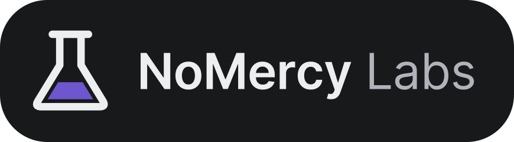

<div align="center">



<p align="center">
  Open-source tools from the team behind NoMercy.<br/>
  Built for our own work, made good enough to share.
</p>

[](https://nomercy.tv)
[](https://github.com/NoMercy-Entertainment)
[](https://twitch.tv/Stoney_Eagle)
[](https://discord.com/invite/u3A3KXd2Hd)

</div>

---

### Who we are

[NoMercy Entertainment](https://github.com/NoMercy-Entertainment) builds the NoMercy MediaServer: a self-hosted way to own and stream your own media.
Building it takes a lot of tooling. Memory for our AI agents. Skills that write documentation we can trust. A stream bot. A TV browser that works with a remote.

NoMercy Labs is where those tools live. Each one started as something we needed. Each one is here because it became useful on its own.

### What we stand for

- **Your machine, your data.** Our tools run where you run them. No analytics, no telemetry, no account you did not ask for.
- **Proof, not promises.** A tool that makes a claim ships the check that proves it. If it does not know, it says so. It does not guess.
- **Usable by everyone.** Accessibility is part of the design from the first slice, not a fix added at the end.
- **Self-hosted first.** You can run everything yourself. A hosted version is an option, never a requirement.
- **Open by default.** The code is public, so you can read what it does before you trust it.

---

### Projects

#### For AI-assisted development

| Project | What it does |
|:--|:--|
| [**Grimoira**](https://github.com/NoMercyLabs/grimoira) | Long-term memory for Claude Code. It keeps verified facts, rules and decisions across sessions and projects. Local only: nothing leaves your machine. |
| [**Atlas**](https://github.com/NoMercyLabs/skills/tree/main/skills/atlas) | Documents a whole project as one system, in one voice. Every claim is grounded in the code, and every page passes a fact-check and a reader review. |
| [**Devbox Anywhere**](https://github.com/NoMercyLabs/skills/tree/main/skills/devbox-anywhere) | Builds a ready dev environment for any project: VS Code in the browser, Dev Containers and Remote-SSH, with the toolchain read from the repo. |
| [**Agents**](https://github.com/NoMercyLabs/agents) | Reusable Claude Code agents. Drop one file into your agents folder and call it by name. |
| [**Catalogues**](https://github.com/NoMercyLabs/catalogues) | One-page reference catalogues. Each entry is a one-line definition and a real example. |

#### Apps

| Project | What it does |
|:--|:--|
| [**NomNomzBot**](https://github.com/NoMercyLabs/nomnomzbot) | A stream bot for Twitch, Kick, YouTube and X Live at the same time, from one dashboard. Commands, moderation, song requests, overlays and more. Self-hostable from day one. ([website](https://dev.nomnomz.bot)) |
| [**Arrowz Browser**](https://github.com/NoMercyLabs/Arrowz-Browser) | A web browser for Android TV that you can really use with a remote. Everything works with six keys. Real media playback. It sends nothing about your browsing anywhere. |

### Get started

```bash
# Grimoira, in Claude Code
/plugin marketplace add NoMercyLabs/grimoira
/plugin install grimoira@nomercylabs

# Atlas and Devbox Anywhere, for Claude Code, Codex, Cursor and more
npx skills add NoMercyLabs/skills
```

Atlas and Devbox Anywhere reach your agent through [NoMercyLabs/skills](https://github.com/NoMercyLabs/skills).

### Tech stack

C# · .NET · Kotlin · Jetpack Compose · Python · Docker

### Contributing

Issues and pull requests are welcome. Each repository's README explains how to set it up and build it.
Questions or ideas? Talk to us on [Discord](https://discord.com/invite/u3A3KXd2Hd).
